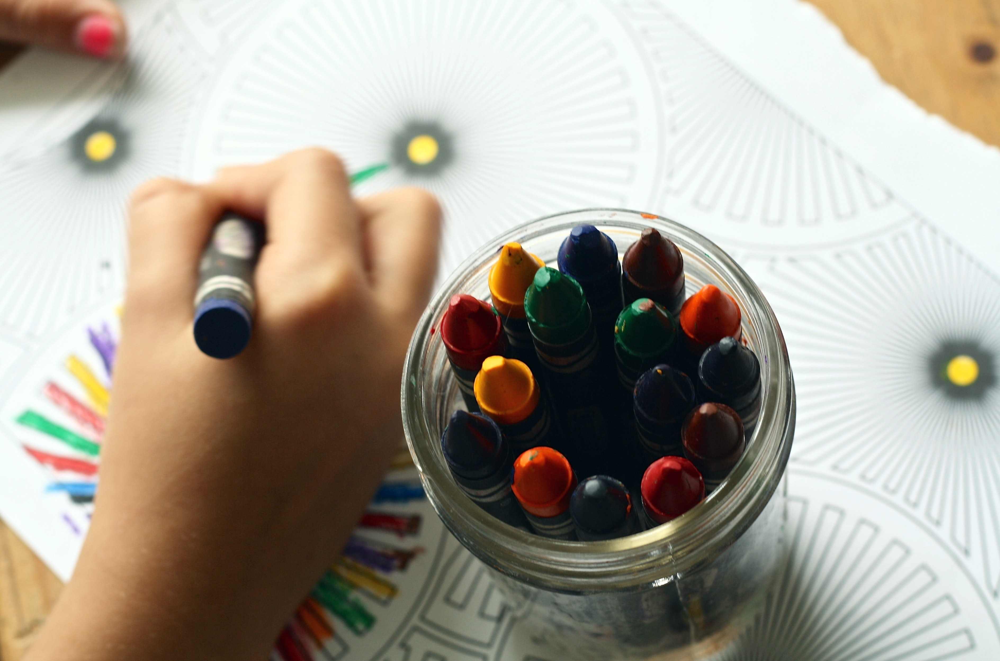

---
---

{ width=175mm }

 
 

## Welcome!

The Study Difference Lab is located in the [School of Psychology](https://www.gla.ac.uk/schools/psychology/) at the University of Glasgow. We use innovalte and fun ways to study person perception and we are especially interested in developing adaptable paradigms to study how children perceive their peers. We proudly endorse the [Open Science Community](https://cos.io) by taking our research out in communities and making our methods transparent and reproducible.

 
 
 
 
 

-----

##### Collaborators
 
[{ width=50mm height=30mm }](https://www.glasgowlife.org.uk/museums/venues/riverside-museum) [{ width=40mm height=20mm }](https://www.glasgowsciencecentre.org) 
 
