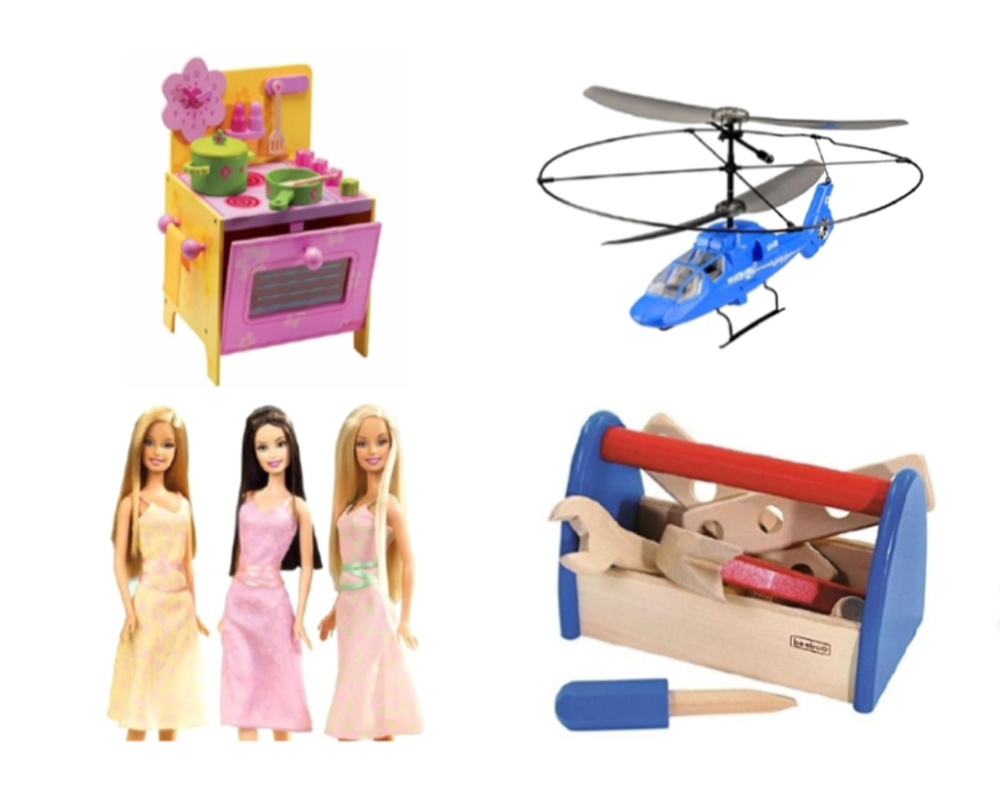
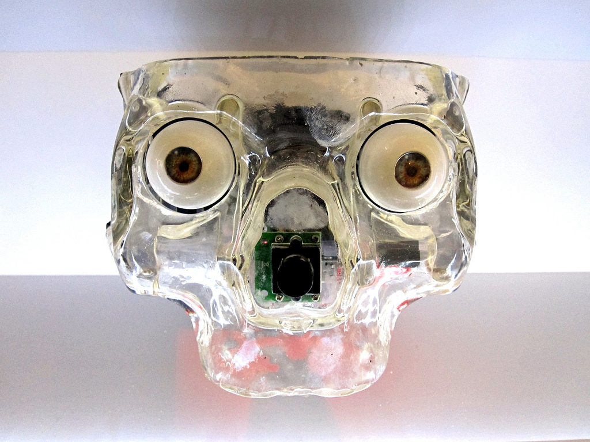

 

### Human Cognition, Representation, and Development of Dynamic Social Events. 
Our every-day world changes constantly, resulting in a dynamic tapestry of events that we must somehow make sense of and interact with. Of the most interesting signals in our dynamic world, are the social signals that allow us to interact with other humans. It seems that the process by which we attribute personality traits, emotions, motivations and intentions is effortless and unconscious. This has lead to some interesting demonstrations whereby non-human animated objects can appear to have the same qualities as humans. This raises the question, how are dynamic social events represented by the human cognitive system. More importantly, how do we develop our representations of social events and the accompanying stereotypes and biases? 
  

### Gender stereotypes

Often implicit gender stereotypes influence behaviour, and research has shown that higher implicit gender stereotypes in parents are associated with more gendered talk to children. Few studies have investigated the relationship between the parent’s and the child’s implicit stereotypes and controversially, only one study has investigated gender stereotypes in both parent and child using the same measure. Also, parental behaviours predict the attitudes of their children, and a more equal divide of household labour predict less gendered aspirations in children. Due to the gap in literature we study factors influencing the development of children's gender stereotypes with a particular focus on parental attitudes and behviours.
  

### Uncanny Valley

The Uncanny Valley phenomenon is the creepy or unsettling feeling that we experience when exposed to a robot with a certain degree of human-like characteristics. Current research indicates that the phenomenon develops throughout childhood, as young children do not find human-like robots to be more weird or creepy than machine-like robots. However, the Uncanny Valley is under-researched in children and further exploration is needed. Our study will replicate and modify Brink, Gray & Wellman’s study (2017) where children will watch videos of two different robots and answer questions about their perception of the robot. 

Brink, K., Gray, K., & Wellman, H. (2017). Creepiness Creeps In: Uncanny Valley Feelings Are Acquired in Childhood. Child Development. doi: 10.1111/cdev.

 

### Perception of visible intellectual disabilities

It is important to explore the attitudes of children towards their peers with Intellectual Disabilities (IDs) in order to guide the integration and acceptance of these individuals within social and educational settings. The use of integrated, rather than segregated, educational classes in primary schools has been found to promote positive attitudes of nurotypical children towards their peers with Down Syndrome. These findings highlight the need to establish a valid and reliable measure of assessing the implicit attitudes of individuals towards people with Down Syndrome, and in particular the attitudes of primary school age children, due to this being such an influential stage in their lives. We will tap into different layers of stigma against children with ID by studying neurotypical children’s implicit attitudes towards ID peers and their playmate choice based on perceived facial similarity.
  

### Research with fun, games and Open Science

We strongly believe in exploration, transparency and reproducibility. Much of our research aims at exploration rather than chasing the p-value. Therefore, a great deal of our research is to develop fun, yet reliable and valid methods for measuring attitudes in children. Since we gather our data from children and adults in open spaces, all tasks must be entertaining and quick. To maintain transparency and reproducibility our tasks are developed using open source software such as [OpenSesame](https://osdoc.cogsci.nl) and our data analysis is done in [RStudio](https://www.rstudio.com). 
