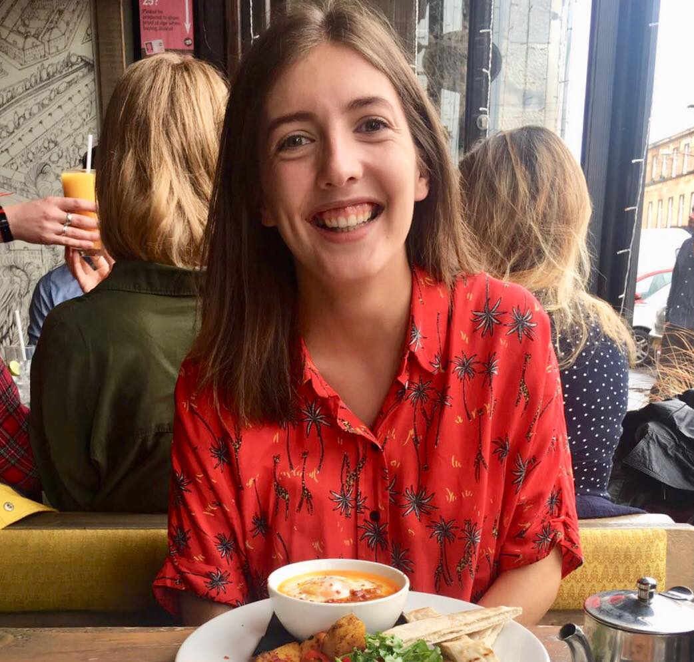
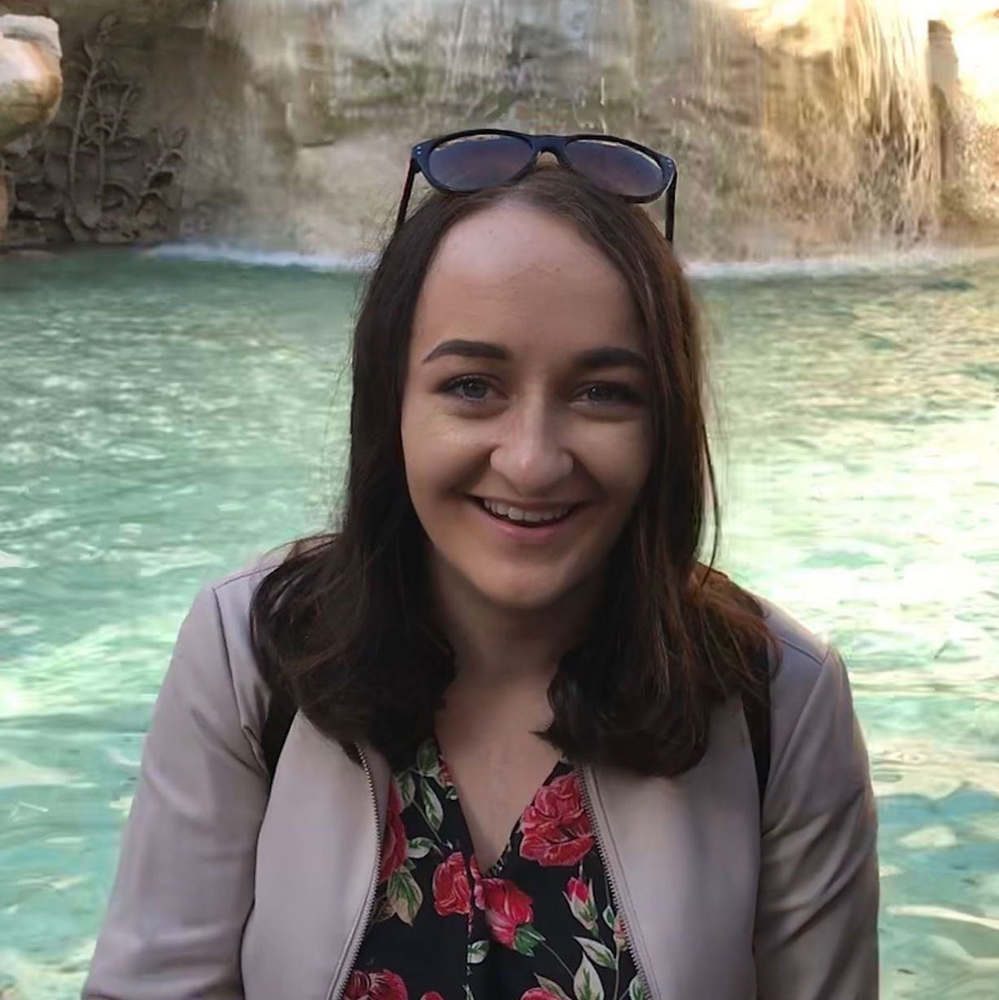
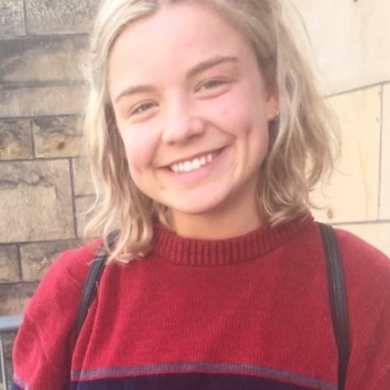

## Sarah McLaughlin

Hi! My name is Sarah and I am a 4th year undergraduate student at the [University of Glasgow](https://www.gla.ac.uk) in the School of Psychology. During my first two years I also studied philosophy and history.  
My broader research interests are investigating the development of attitudes and stereotyping in children. My dissertation is supervised by Dr. Helena Paterson and we are studying the uncanny valley phenomenon.
  
<i class="fa fa-envelope"></i> <a href="mailto:2025041M@student.gla.ac.uk">Sarah McLaughlin</a>
  

---

## Caitlin Moran

My name is  Caitlin and I am a final year undergraduate psychology student at the [University of Glasgow](https://www.gla.ac.uk). I am in the process of completing my MA in psychology, and in my first and second year I also studied history and theology.
My dissertation project is supervised by Dr. Helena Paterson and we are looking at the development of attitudes in children and their parents. 
  
<i class="fa fa-envelope"></i> <a href="mailto:2199840M@student.gla.ac.uk">Caitlin Moran</a>
  

---

## Katie Talbot

I am an 4th year Undergraduate Psychology student at the [University of Glasgow](https://www.gla.ac.uk). I am currently in my fourth and final year, and will graduate in May (2019) with a BSc in Psychology. 
 
As part of my final year I am required to complete a Dissertation. I am carrying out my research in the area of Social Psychology. The research aims to investigate the implicit attitudes of individuals towards their peers with Down Syndrome and the project is supervised by Dr. Helena Paterson.  
 
<i class="fa fa-envelope"></i> <a href="mailto:2195717T@student.gla.ac.uk">Katie Talbot</a>